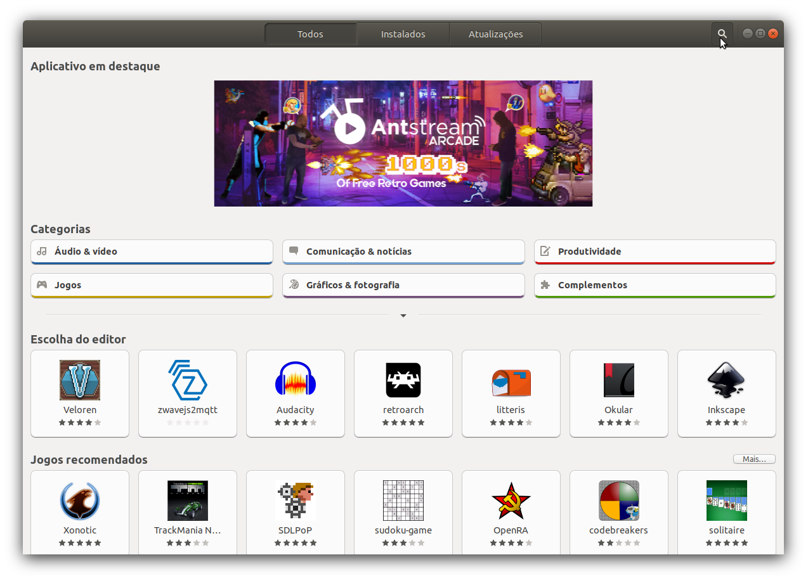
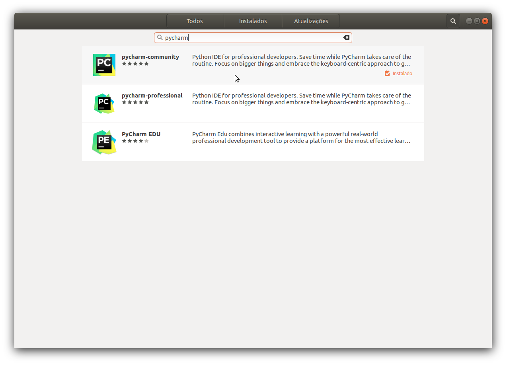
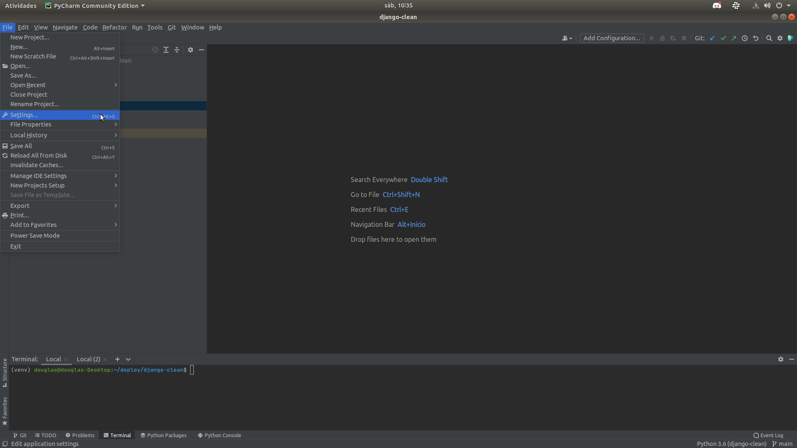
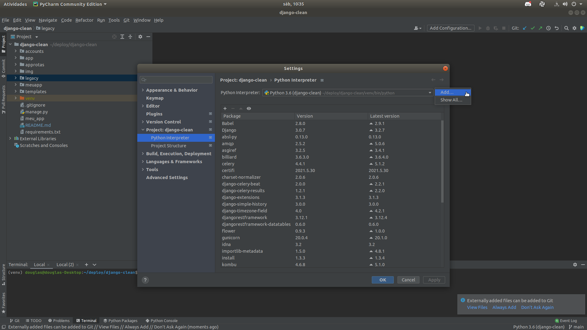
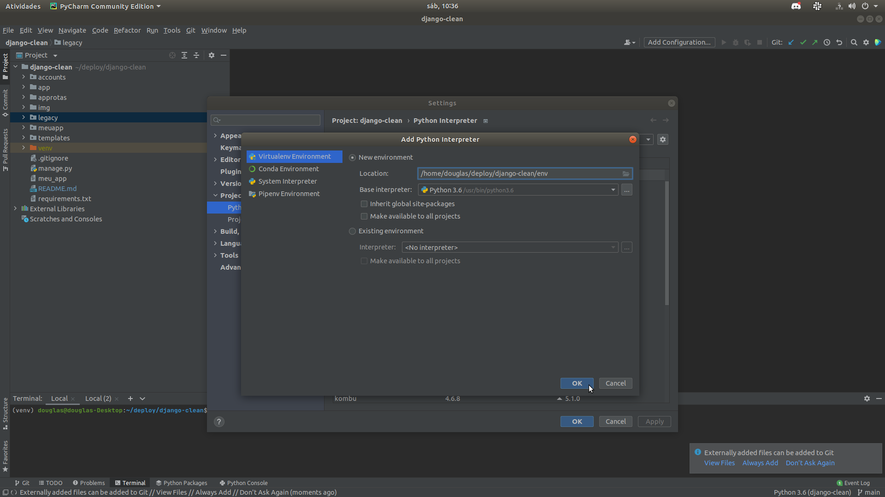
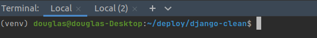
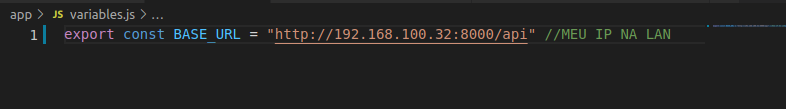

# Rota Show  
- Equipe: <br>
    - Caliny Basílio de Oliveira <br />
    - Christopher de Almeida Martins <br />
    - Daniel Lopes Bueno Lobato<br />
    - Douglas Gonçalves Sales<br />
    - Pedro Henrique Figueiredo Salim<br />
    - Henrique de Lima Barroso <br />

- Sobre
    - Estrutura de Pastas do projeto
        - accounts: <br />
            <i>Contêm as definições e lógicas do sistema de autenticação e registro de usuários.</i>
        - app:<br />
            <i>Contêm os arquivos de definição do aplicativo desenvolvido com a utilização do expo. Mais informações a seguir.</i>
            - assets:<br />
            <i>Arquivos e imagens utilizadas no aplicativo.</i>
            - components:<br />
            <i>Componentes React do sistema. Importados nas telas.</i>
            - context:<br />
            <i>Contexto de Autenticação do sistema. Utilizamos este contexto para armazenar o token do usuário e realizar chamadas a apis.</i>
            - routes:<br />
            <i>Arquivos que separam as rotas privadas (que requerem autentiacação) e públicas. Registramos as telas que podem ser acessadas nestes arquivos.</i>
            - screens:<br />
            <i>Contêm cada uma das telas do aplicativo.</i>
            - App.js:<br />
            <i>Arquivo raiz do aplicativo.</i>
            - reducers.js:<br />
            <i>Arquivo de registro de alteradores de estado do redux. Só utilizamos um único reducer (Home) no aplicativo.</i>
            - store.js:<br />
            <i>Configuração de armazenamento de estado do aplicativo.</i>
            - variables.js:<br />
            <i>Definições de variáveis de ambiente (DESENVOLVIMENTO, TESTE ou PRODUÇÃO) do aplicativo.</i>
        - img:<br />
            <i>Imagens utilizadas nesta documentação.</i>
        - legacy:<br />
            <i>Contêm as definições e lógicas do sistema de geração de rotas.</i>
        - meuapp:<br />
            <i>Contêm os arquivos de configuração e raiz do Sistema.</i>
        - templates:<br />
            <i>Arquivos de template html.</i>
        - insomnia_export.json:<br />
            <i>Biblioteca com exemplos e testes das APIS do sistema. Pode ser importado no Insomnia para mais informações.</i>
        - manage.py:<br />
            <i>Script do Django, pelo qual executamos comandos no Backend.</i>
        - requirements.txt:<br />
            <i>Listagem de pacotes e versões requeridas pelo sistema.</i>
- Considerações

## 1. Instalação
### Backend
- Python 3 e pip
(no terminal digite)
```
    sudo apt-get install python3.6 python3-pip
```

- Pycharm Community Edition <br />
Abra o Software Manager e utilize o botão de pesquisa para encontrar o pacote do Pycharm Community Edition. <br />
Clique na Lupa e pesquise por pycharm.
 <br />
Selecione pycharm-community. <br />
 <br />
Clique no botão Instalar e aguarde a finalização.

- Criar Ambiente Virtual <br />
Abra o Pycharm, clique em Open e selecione a pasta do projeto. <br />
Abra o menu FILE > SETTINGS.<br />
 <br />
Navegue para Project > Python Interpreter. <br />
Clique no botão da engrenagem e selecione a opção add.<br />
 <br />
Selecione Python 3.6 no Campo Base Interpreter e Clique em OK. <br />
Feche a janela de configurações do Pycharm.<br />
 <br />
Na parte inferior do Pycharm, clique no botão Terminal e verifique se o seu ambiente virtual está ativado antes de prosseguir. <br />
 <br />
No início do seu terminal deverá haver uma mensagem (venv), caso não haja, feche o projeto e abra-o novamente ou digite o seguinte comando no terminal:
    ```
    . venv/bin/activate
    ```
<br />

- Instalar Dependências do Projeto. <br />
No terminal do Pycharm, digite:
    ```
    pip install -r requirements.txt
    ```

- Executar Migrações. <br />
No terminal do Pycharm, digite:
    ```
    python manage.py migrate
    ```
    
- Criar Super Usuário. <br />
No terminal do Pycharm, digite:
    ```
    python manage.py createsuperuser
    ```
    
- Executar o Servidor. <br />
No terminal do Pycharm, digite:
    ```
    python manage.py runserver 0.0.0.0:8000
    ```


### Frontend
- Instalar Curl <br />
    No terminal do Linux, digite: <br />
    ```
    sudo apt-get install curl
    ```
- Instalar Node.js 16.9.1. <br />
    No terminal do Linux, digite: <br />
    ```
    cd ~
    curl -o- https://raw.githubusercontent.com/nvm-sh/nvm/v0.35.3/install.sh | bash
    source ~/.bashrc
    nvm install v16.9.1
    ```
   
- Instalar yarn. <br />
    No terminal do Linux, digite: <br />
    ```
    sudo npm install --global yarn
    ```
    
- Instalar Expo. <br />
    No terminal do Linux, digite: <br />
    ```
    sudo yarn global add expo-cli
    ```

- Instalar Dependências do Projeto. <br />
    No terminal do Linux, navegue para a raiz do projeto e digite os  comandos a seguir: <br />
    ```
    cd app
    yarn install
    ```

    
- Configurar Variáveis. <br />
    Precisamos informar ao aplicativo o nosso número de ip para que possamos acessar o servidor de backend no ambiente de desenvolvimento. Para isso, descubra seu endereço de ip utilizando o comando ifconfig ou através de outros meios que preferir, e o digite dentro do arquivo variables.js, da seguinte forma: <br />
     <br />

- Rodar o Projeto. <br />
    No terminal do Linux, dentro da pasta app digite: <br />
    ```
    yarn start
    ```
    Uma página será aberta no navegador. <br />
    Na parte esquerda, acima do código QR, clique em LAN e aguarde a iniciação.

- No seu smartphone, instale o aplicativo Expo, disponível para Android e IOS. <br />
    https://apps.apple.com/br/app/expo-go/id982107779 <br />
    https://play.google.com/store/apps/details?id=host.exp.exponent&hl=pt_BR&gl=US <br />
    

- Abra o aplicativo, selecione a opção SCAN QR CODE e leia o código disponibilizado no navegador. <br />
    Aguarde a instalação, o aplicativo será aberto no modo de desenvolvimento.
    
- Divirta-se!

## 2. Documentação APIs
Aqui listamos as APIS disponíveis. Para mais informações e exemplos, importe o arquivo do insomnia disponível na raiz do projeto. <br />

- Public Routes
    - Login [POST] <br />
    ```
        /api/accounts/token/
    ```

    - Create User [POST] <br />
    ```   
        /api/accounts/users/
    ```

- Private Routes <br />
    Requer header: Authorization: "Token {USER_TOKEN}"<br />
    Também requer que o objeto em questão pertença ao usuário que efetua a requisição. <br />

    - USER <br />
        - Read User [GET] <br />
        ```
            /api/accounts/users/{token_user_id}/
        ```

        - Update User [PUT]<br />
        ```
            /api/accounts/users/{token_user_id}/
        ```

        - Delete User [DELETE]<br />
        ```
            /api/accounts/users/{token_user_id}/
        ```

    - LOCALS <br />
        - Create Local [POST] <br />
        ```
            /api/locals/
        ```


        - Read Local [GET]<br />
        ```
            /api/locals/{local_id}/
        ```

        - Update Local [PUT] <br />
        ```
            /api/locals/{local_id}/
        ```

        - Delete Local [DELETE]<br />
        ```
            /api/locals/{local_id}/
        ```

        - List Locals [GET]<br />
        ```
            /api/locals/
        ```
    - ROUTES <br />
        - Generate [POST]<br />
        ```
            /api/routes/generate/
        ```
